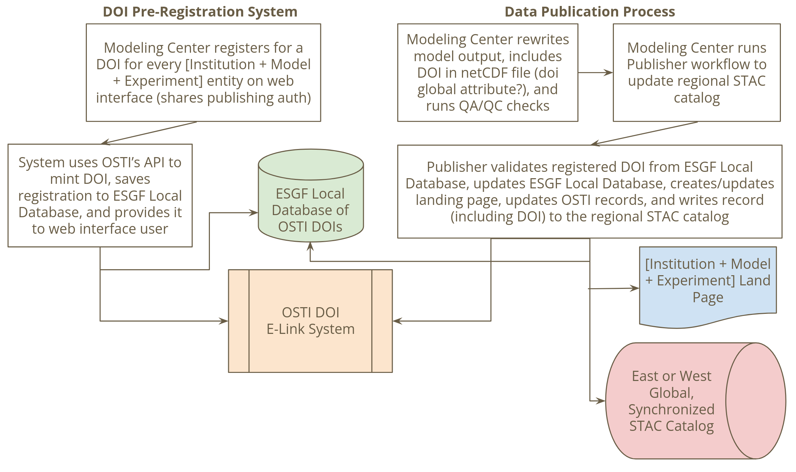

# Proposed ESGF DOI Service

## Background:
Digital Object Identifiers (DOI) is a digital identifier to uniquely identify digital objects, such as datasets in ESGF.

A review of data citation service requirements for CMIP was conducted by Stockhause et. al. 2024 and provided recommendations for a sustainable data citation service.

>Stockhause, M., Ames, S., Dingley, B., Lawrence, B., Liang, H.-C., Liu, Y., Parton, G. and Radhakrishnan, A. (2024). Recommendations for a sustainable data citation service for CMIP. [online] Zenodo. Available at: [https://doi.org/10.5281/zenodo.13748704](https://doi.org/10.5281/zenodo.13748704).

## Objective:
Objective of ESGF DOI service is to offer an service for DOI
registration for CMIP7 datasets, maintain landing pages, and integrate
with data publication workflows. The service is expected to be available
for all projects under `mip_era = CMIP7`, including `input4MIPs` and
`obs4MIPs`. DOIs from ESGF DOI Service is however optional, and data
producers/modeling centers can choose to use their own DOIs.

## Proposed Workflow:
Proposed below is an workflow that can be designed and maintained by
ESGF2-US team. ESGF2-US will leverage 
[US Department of Energy's (DOE) DATA ID
Service](https://www.osti.gov/pids/doi-services/doe-data-id-service)
that registers the DOIs with [DataCite](https://www.datacite.org/) to aid 
in citation, discovery, retrieval, and reuse. 

Flowchart below provides an overview of the proposed DOI service.

### Data granularity for DOIs
DOIs will be issued for unique combination of `mip_era` + `institution_id` + `source_id` + `experiment_id`

Issued DOIs will follow the format: `10.25981/ESGF.{mip_era}.{institution_id}.{source_id}.{experiment_id}/XXXXXX`

> [!NOTE]
> Is this the appropriate granularity for DOIs or should they be different?

### DOI Pre-registration
Authenticated data producers would be able to pre-register for a DOI via a web interface by providing metadata necessary to register a DOI with DataCite. DOI metadata will be saved in a local database, and be used for registering the DOI. Interface would ensure a single DOI to be registered for each unique dataset. We will saved information about any datasets known to have plans for using external issued DOIs, and allow a ESGF DOI to be issued for them.

| Metadata Field |        | Source |
| -------------- | ------ | ------ |
| Title          | {institution_id} {source_id} model output prepared for {mip_era} {experiment_id}.       |  CVs      |
| Authors        | [Name, Email, ORCID, Affiliation]      |    Where can be get authors list for CMIP7?    |
| Description    |   Can be assembled from CVs, will include `further_info_url`     |        |

> [!NOTE]
> Should the ESGF DOI database track non-ESGF DOIs?

> [!NOTE]
> Authors list --> Can this be extracted from CVs or EMD? OR should we allow this to be entered on pre-registration form?

> [!NOTE]
> ESGF2-US maintained service would use Globus-based authentication. How will the credentials be managed distributed?

### DOI Registration
ESGF DOI Service would use DOE ELINK Service to register and mint a draft DOI. This DOI will be presented to the user via web interface and saved within the local database. DOI will stay in draft form and not released until after data has been published to ESGF.

### DOI to be embedded within the netCDF files
Modeling center should include the `doi: DOI` within the global attribute of the netCDF files.

### Integration with the ESG Publisher
[ESG Publisher](https://github.com/ESGF/esg-publisher) will check the `doi` global attribute in the netCDF files and ensure the DOI metadata match the dataset attributes. Any mismatch in dataset and DOI will be identified by the Publisher and prevent any erroneous data to be published. Once the DOI validation pass, Publisher will publish the data, trigger generation of DOI landing pages, and update DOI registration to complete and activate the DOI registration.

### DOI Landing Pages
ESGF DOI Service will autogenerate landing pages for DOIs using [MyST](https://mystmd.org/).

Landing page will follow the [best practices guidelines](https://support.datacite.org/docs/landing-pages) provided by DataCite.

